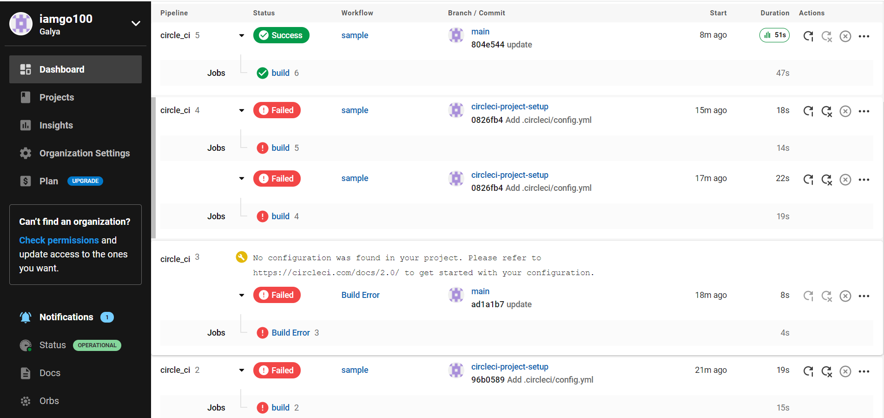

# Лабораторная работа 4. Отчет

### Задание 1

Для выполнения данной лабораторной работы был использован конфигурационный файл [config.yml](.circleci/config.yml)

В нем были написаны команды для конфигурации того, что приложение будет работать на основе языка Python. Далее написана команда run, в которой прописано, что нужно установить, прежде чем запускать приложение на docker. И затем пишется запуск самого приложения.

Ниже представлен скриншот процесса сборки и его успешного выполнения.

Я создавала портфолио с помощью фреймфорка Flask. Этот инструмент позволяет создать быстро и просто сервер для веб-сайта, что идеально подходит для данного случая.

### Задание 2

Так как мое портфолио достаточно мало по объему, в него не нужно загружать достаточно много ссылок на файлы статики, поэтому Webpack для сборки этих файлов в данном приложении не нужен совершенно.